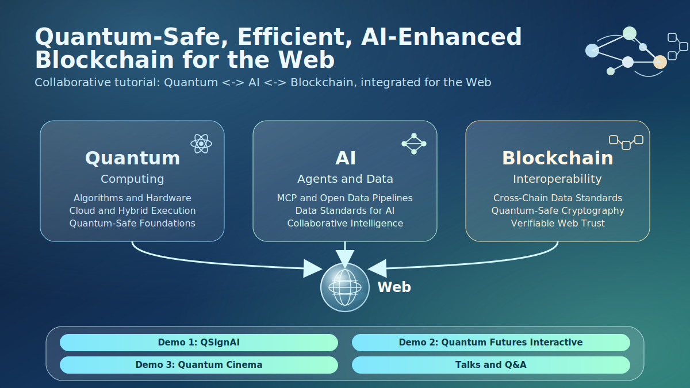

# Quantum-Safe, Efficient, and AI-Enhanced Blockchains for the Web
## A Cooperative Tutorial on Quantum Computing, Blockchain Applications, and Data Standards

**ACM Web Conference 2026 (WWW Companion '26)** — Online Session  
**Date:** June 29, 2026  
**Time:** 14:00 – 17:30 (3.5 hours, GST+4 Dubai Time)

[](https://www2026.thewebconf.org/program/full-schedule.html)
[](https://www2026.thewebconf.org/accepted/tutorials.html)
[](https://dl.acm.org/doi/10.1145/3774905.3793916)

---

## Teaser Figure 🎬



---

## Agenda 🗓️

| ⏰ Time | 🧩 Segment |    Speaker | 🔗 Resources |
|:---|:---|:---|:---|
| 14:00–14:30 | QSignAI Demo |    All | [`demos/01-qsignai/`](https://github.com/QuantBlockchain/www26-qab4web/tree/main/demos/01-qsignai) |
| 14:30–15:00 | Quantum Futures Interactive (QFI) Demo |    All | [`demos/02-quantum-futures-interactive/`](https://github.com/QuantBlockchain/www26-qab4web/tree/main/demos/02-quantum-futures-interactive) |
| 15:00–15:30 | Quantum Cinema Demo |    All | [`demos/03-quantum-cinema/`](https://github.com/QuantBlockchain/www26-qab4web/tree/main/demos/03-quantum-cinema) |
| 15:30–16:00 | Quantum Computing and Cloud Infrastructure for the Web |  Aoyu Zhang | [`talks/04-aoyu-quantum-cloud/`](./talks/04-aoyu-quantum-cloud/) |
| 16:00–16:30 | Open Data, MCP, and AI Agent Applications for the Web |  Dongping Liu | [`talks/05-dongping-open-data-mcp/`](./talks/05-dongping-open-data-mcp/) |
| 16:30–17:00 | Quantum Computing, Data Standard, and Blockchain Interoperability for the Web |  Luyao Zhang | [`talks/06-luyao-quantum-standard-interop/`](./talks/06-luyao-quantum-standard-interop/) |
| 17:00–17:30 | **Buffer, Breaks, and Q&A** |    All | — |

---

## Quick Links ⚡

| 🎯 Demo | 📄 arXiv | 💻 GitHub | 🖥️ UI |
|:---|:---|:---|:---|
| **QSignAI** | [](https://arxiv.org/abs/2605.27729) | [](https://github.com/QuantBlockchain/QSignAI) | [](https://qsignai.com/wall/qsignai-www) |
| **Quantum Futures Interactive (QFI)** | [](https://arxiv.org/abs/2605.15991) | [](https://github.com/QuantBlockchain/qc-bc-interactive) | [](https://d375odhl9u0dsz.cloudfront.net/) |
| **Quantum Cinema** | [](https://arxiv.org/abs/2606.17102) | [](https://github.com/QuantBlockchain/quantum-cinema) | [](https://d3ospai7r368nk.cloudfront.net/) |

---

## Speaker Bios 👩‍🏫

The IEEE ICBCTutorial source includes five speakers. This WWW tutorial includes three of them. In this tutorial, all three jointly present the demo session, and each leads one talk segment:

> ℹ️ Note: Speakers are listed in alphabetical order by last name, then first name.

<table>
  <colgroup>
    <col style="width: 55%;" />
    <col style="width: 45%;" />
  </colgroup>
  <thead>
    <tr>
      <th style="width: 55%;">👤 Speaker</th>
      <th style="width: 45%;">📝 Bio</th>
    </tr>
  </thead>
  <tbody>
    <tr>
      <td style="width: 55%;"><br><br><strong> Dr. Dongping Liu</strong><br><br><sub><strong>🧭 WWW 2026 Roles</strong></sub><br><sub>🎬 Co-presenter of all demos (14:00-15:30)</sub><br><sub>🎤 Talk lead: Open Data, MCP, and AI Agent Applications for the Web (16:00-16:30)</sub></td>
      <td>Dongping Liu is a former Senior Industry Business Development Manager for Higher Education and Research at Amazon Web Services, where he specializes in driving digital transformation in academia through AI, deep learning, and high-performance computing solutions. With 15 years of experience in the higher education and research sector, he has successfully led the implementation of cutting-edge cloud technologies for educational institutions and research organizations. His expertise spans educational technology innovation, business development strategy, and large-scale research computing deployments. He has been awarded the First Prize of Beijing Science and Technology Award, published 30+ research papers, and obtained 10+ authorized patents along with multiple software copyrights. He contributes to this tutorial by bridging academic research needs with practical AWS cloud solutions and sharing insights on AI/HPC applications in higher education. He holds a Ph.D. in Physics from the Institute of Physics, Chinese Academy of Sciences, and completed postdoctoral research at McGill University, Canada. He is currently the CEO of Tenorshare, but the work involved was done while he was at AWS.</td>
    </tr>
    <tr>
      <td style="width: 55%;"><br><br><strong> Dr. Aoyu Zhang</strong><br><br><sub><strong>🧭 WWW 2026 Roles</strong></sub><br><sub>🎬 Co-presenter of all demos (14:00-15:30)</sub><br><sub>🎤 Talk lead: Quantum Computing and Cloud Infrastructure for the Web (15:30-16:00)</sub></td>
      <td>Aoyu Zhang is Senior Applied Scientist at AWS China Solution Development Center, where he advances the design and implementation of AI and quantum cloud solutions. He used to develop open-source quantum computing solutions for drug discovery under Amazon Braket. His research also includes hybrid quantum-classical algorithms, quantum benchmarking, and cross-domain applications in blockchain security and Web-scale cryptography. He delivered the keynote at the 2025 forum on Cloud Computing Services for Blockchain Security and contributes to this tutorial by leading the quantum core and live Amazon Braket demonstrations. He holds a Ph.D. in Biomedical Engineering from Peking University.</td>
    </tr>
    <tr>
      <td style="width: 55%;"><br><br><strong> Dr. Luyao Zhang</strong><br><br><sub><strong>🧭 WWW 2026 Roles</strong></sub><br><sub>🎬 Co-presenter of all demos (14:00-15:30)</sub><br><sub>🎤 Talk lead: Quantum Computing, Data Standard, and Blockchain Interoperability for the Web (16:30-17:00)</sub></td>
      <td>Luyao Zhang is a tenure-track Assistant Professor of Economics and Senior Research Scientist at Digital Innovation Research Center at Duke Kunshan University. Her research bridges computational and economic sciences through groundbreaking technologies for intelligent economics, encompassing big data, blockchain, generative AI, and geospatial analysis, with publications in Review of Economics and Statistics, Scientific Data, ACM CCS, IEEE S&amp;P, ACM CSCW, and NeurIPS Datasets and Benchmarks. She holds a Ph.D. in Economics from The Ohio State University (Presidential Fellowship, NSF support) and a dual degree from Peking University (B.A. in Economics and B.S. in Mathematics), with professional certificates from Oxford and MIT in blockchain, reinforcement learning, and quantum computing. Her NSFC-funded project "Trust Mechanism Design on Blockchain" integrates game theory, reinforcement learning, and human-AI interaction. She serves as Guest Editor for Electronic Markets, Editorial Board Member of Scientific Data and Blockchain: Research and Applications, Working Group Secretary for IEEE P3469, and Academic Editor of Blockchain – Pioneering the Web3 Infrastructure for an Intelligent Future (2025).</td>
    </tr>
  </tbody>
</table>

---

## Repository Structure 📁

- **`demos/`** — Each folder contains a `README.md` with the arXiv paper and external GitHub repo for the corresponding interactive demo.
- **`talks/`** — Each folder contains the speaker's slide PDF.

---

## Citation 📚

If you use these materials, please cite:

```bibtex
@inproceedings{www26-qab4web,
  title={AI-Enhanced Quantum-Safe Blockchains for the Web: 
         A Cooperative Tutorial on Quantum Computing, 
         Blockchain Applications, and Data Standards},
  author={Liu, Dongping and Zhang, Aoyu and Zhang, Luyao},
  booktitle={Companion Proceedings of the ACM Web Conference 2026},
  year={2026}
}
```

---

## License 📜

This work is licensed under [MIT](LICENSE).
